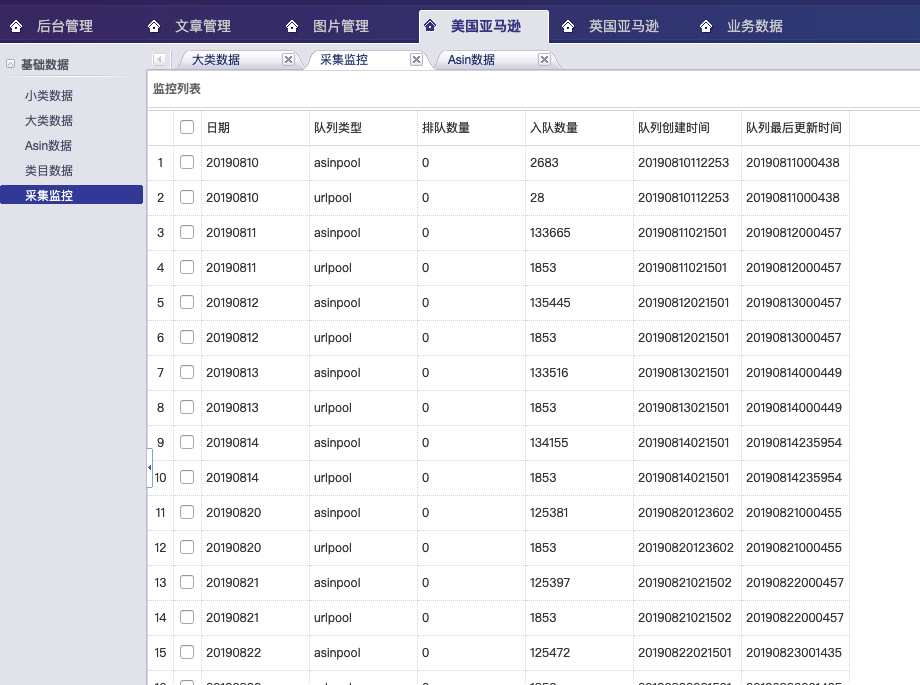
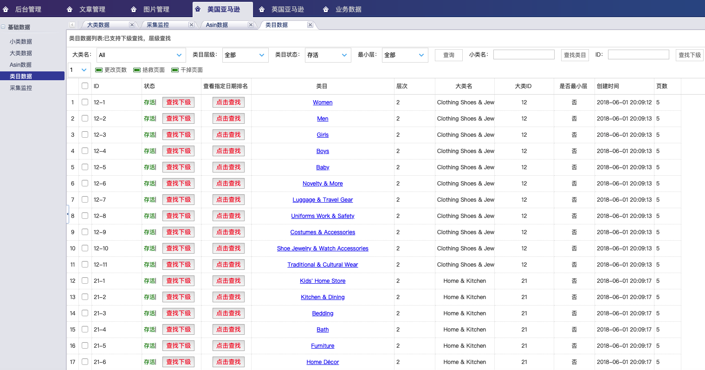
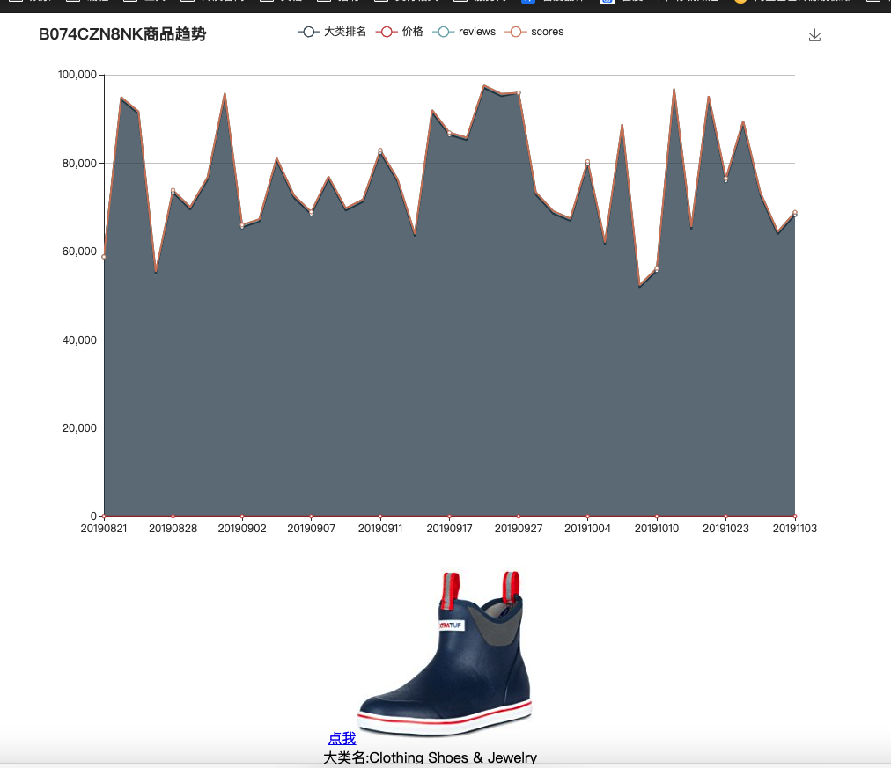
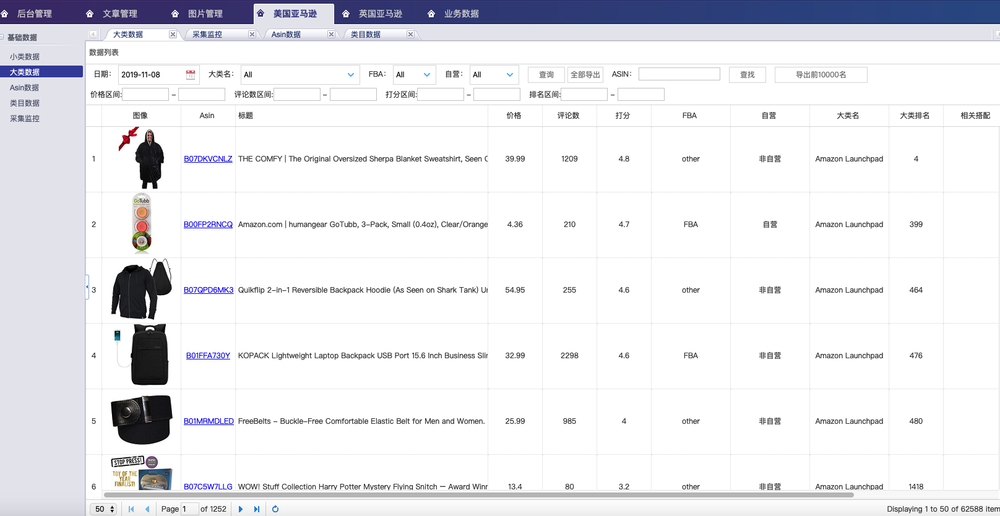

# Project: Lizard

[](https://github.com/hunterhug/lizard/network)
[](https://github.com/hunterhug/lizard/stargazers)
[](https://github.com/hunterhug/lizard)
[](https://goreportcard.com/report/github.com/hunterhug/lizard)
[](https://github.com/hunterhug/lizard/issues)

阿里云做活动了，2核4G 云服务器89元/年

https://www.aliyun.com/minisite/goods?userCode=mcpvtmk4&share_source=copy_link


此仓库为跨境电商全网选款产品的服务端代码，可视化前端界面仓库在此：[https://github.com/hunterhug/lizardWeb](https://github.com/hunterhug/lizardWeb)

相对温馨的精细化选款新产品已经开发完毕了：[饕餮选款服务端：Golang高性能精细化选款系统](https://github.com/hunterhug/taotie)

## 一. 介绍


此项目使用`Golang`语言开发, 采集并发速度快, 前端使用`beego`开发. 已经老古董, 开发周期两年, 基本还能运行.

本项目前后端具体组件已经拆分出来:

1. [💐Marmot | Web Crawler/HTTP protocol Download Package  🐭](https://github.com/hunterhug/marmot)
2. [💐Rabbit  | Beego Simple Web| Easy use for everyone🐰](https://github.com/hunterhug/rabbit)

平台具体使用请查看[亚马逊大数据智能选款平台使用手册v1.2.pdf](%E4%BA%9A%E9%A9%AC%E9%80%8A%E5%A4%A7%E6%95%B0%E6%8D%AE%E6%99%BA%E8%83%BD%E9%80%89%E6%AC%BE%E5%B9%B3%E5%8F%B0%E4%BD%BF%E7%94%A8%E6%89%8B%E5%86%8Cv1.2.pdf)。 

最新图片：









### 1. 中文介绍

用途： 选款，特别适合亚马逊跨境电子商务运营公司(不支持中国亚马逊)。核心竞争力： 四个国际站点：`美国/英国/日本/德国`，分布式，配套后台可视化。

关于选款： `TOP20W` 排名商品供你自由选择。

亚马逊爬虫支持：

1. 列表页和详情页可选择代理方式
2. 多浏览器保存cookie机制
3. 机器人检测达到阈值自动换代理
4. 检测日期过期自动停止程序
5. IP池扫描周期填充代理IP
6. 支持分布式跨平台抓取
7. 高并发进程设置抓取
8. 默认网页爬取去重
9. 日志记录功能
10. 配套可视化网站，支持多角度查看数据，小类数据，大类数据，Asin数据和类目数据，支持查看每件Asin商品的历史记录，如排名，价格，打分，reviews变化。部分数据支持导出，且网站支持RBAC权限，可分配每部分数据的查看和使用权限。
11. 网络端监控爬虫，可查看爬虫当前时段数据抓取状态，爬取的进度，IP的消耗程度。   **可支持网络端启动和停止爬虫，彻底成为Saas**（待做）
12. 可自定义填入IP，如塞入其他代理IP网站API获取的IP
13. 可选择HTML文件保存本地

分布式，高并发，跨平台，多站点，多种自定义配置，极强的容错能力是这个爬虫的特点。机器数量和IP代理足够情况下，每天每个站点可满足抓取几百万的商品数据。

### 2. 简单一瞥

类目，你可以自行更改抓取页数，是否抓取。


小类数据，基本Top100商品数据。


大类数据，很详细，包括大类排名等，可以复杂查询条件筛选，下载。


产品趋势，你可以看到产品十几天的排名变化，价格变化。


导出的EXCEL


### 3. 软件架构

老的：


新的：


类目大体如下。

```
+----------------------------+-----------------+
| bigpname                   | count(bigpname) |
+----------------------------+-----------------+
| Amazon Launchpad           |              22 |
| Appliances                 |              34 |
| Arts Crafts & Sewing       |             470 |
| Automotive                 |            3162 |
| Baby                       |             333 |
| Beauty & Personal Care     |             406 |
| Camera & Photo             |             214 |
| Cell Phones & Accessories  |              61 |
| Clothing Shoes & Jewelry   |            1803 |
| Collectible Coins          |               3 |
| Computers & Accessories    |             294 |
| Electronics                |            1292 |
| Entertainment Collectibles |              43 |
| Gift Cards                 |              19 |
| Grocery & Gourmet Food     |            1324 |
| Health & Household         |            1185 |
| Home & Kitchen             |            1903 |
| Industrial & Scientific    |            3325 |
| Kitchen & Dining           |             738 |
| Musical Instruments        |             612 |
| Office Products            |             736 |
| Patio Lawn & Garden        |             590 |
| Pet Supplies               |             499 |
| Prime Pantry               |               1 |
| Sports & Outdoors          |            2686 |
| Sports Collectibles        |              57 |
| Tools & Home Improvement   |            1666 |
| Toys & Games               |             791 |
+----------------------------+-----------------+
```

# 免责声明

本产品遵循`署名-非商业性使用-禁止演绎 4.0 国际`。您可用于教育，学习，但不可用于商业盈利。

关于版权，爬虫有风险, 本人不承担由此开源项目带来的任何责任。

```
	版权所有，侵权必究
	署名-非商业性使用-禁止演绎 4.0 国际
	警告： 以下的代码版权归属hunterhug，请不要传播或修改代码
	你可以在教育用途下使用该代码，但是禁止公司或个人用于商业用途(在未授权情况下不得用于盈利)
	商业授权请联系邮箱：gdccmcm14@live.com QQ:459527502

	All right reserved
	Attribution-NonCommercial-NoDerivatives 4.0 International
	Notice: The following code's copyright by hunterhug, Please do not spread and modify.
	You can use it for education only but can't make profits for any companies and individuals!
	For more information on commercial licensing please contact hunterhug.
	Ask for commercial licensing please contact Mail:gdccmcm14@live.com Or QQ:459527502

	2017.7 by hunterhug
```


## 支持

如何部署该系统请参考: [搭建说明](/install.md), 你也可以参考一次实例安装[阿里云安装该产品](ubuntu.md)。

微信支持:


支付宝支持:


